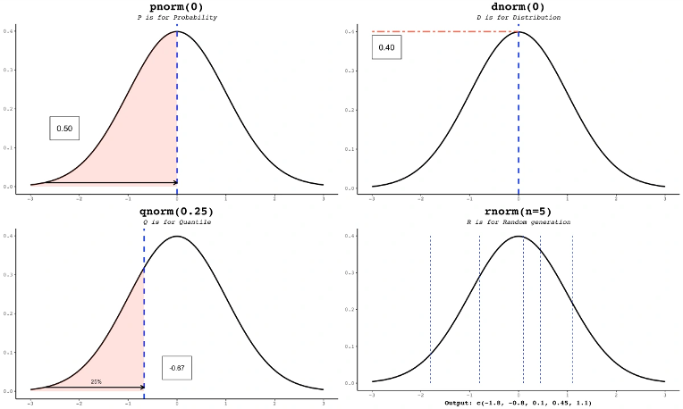

# Distribución normal


- En lo que respecta a la distribución normal, es importante acotar que: 

  - µ:la media, que desplaza el centro de la curva a lo largo del eje x.
  
  - σ: la desviación estándar, que modifica qué tan dispersos están los datos con respecto a la media.    
- Una regla empírica muy útil al momento de trabajar con distribuciones normales es la llamada regla
  68-95-99.7:
  - Cerca de 68 % de las observaciones se encuentran a una distancia de una desviación estándar de la
  media.
  - Alrededor de 95 % de las observaciones se encuentran a una distancia de dos desviación estándar de la media.
  - Aproximadamente 99.7 % de las observaciones se encuentran a una distancia de tres desviación estándar de la media.

```{r dos gráficas de distribución normal}

  library(ggpubr) 
  #Generar valores para una distribucion normal con media 0 y  desviacion estandar 1.
  media <- 0 
  desv_est <- 1 
  x <- seq(-15, 35, 0.01) 
  y <- dnorm(x, mean = media, sd = desv_est) 
  normal_1 <- data.frame(x, y)
  # Repetir el proceso para una distribuci6n normal con media 10 y desviacion estandar 6. 
  media <- 10
  desv_est <- 6
  x <- seq(-15, 35, 0.01)
  y <- dnorm(x, mean = media, sd = desv_est) 
  normal_2 <- data.frame(x, y)
  #Graficar ambas distribuciones. 
  g <- ggplot(normal_1, aes(x, y)) + geom_line(color = "blue") 
  g <- g + geom_line(data = normal_2, color = "red") 
  g <- g + theme_pubr()
  print(g)


```


Otro dato importante al momento de utilizar la funcion de distribución normal corresponde a lo siguiente:



```{r funciones_normal, include=FALSE, echo = FALSE}
  mu = 0
  sigma = 1
  #Distribucion Normal
  dnorm(x, mu, sigma) #Funcion de densidad de una Distribucion normal, te da la probabilidad puntual de que ocurra x en una distribucion normal de media mu y desv sigma

  pnorm(x,mu,sigma,lower.tail = TRUE) #funcion de distribucion de una distribucion normal, te da la probabilidad acumulada de que ocurra x en una distribucion normal de media mu y desv sigma, cola inferior es decir <=
  
  probabilidad_deseada = 0.5
  qnorm(probabilidad_deseada,mu,sigma) #Entrega el valor de X que acumula la probabilidad deseada
  
  n = 100
  #rnorm(n,mu,sigma) #Simula una distribucion normal de tamaño n y parametors mu y sigma

```

# Análisis de normalidad

Entre algunos de los métodos los cuales nos permiten analizar que la población de la cual
provienen los datos sigue una distribución normal de probabilidad corresponden a:

- Gráfico cuantil cuantil
- Test De hipotesis

```{r normalidad_cuantil_cuantil}

  library(nortest)
  
  library ( ggpubr)
   # Cargar datos .
  datos <- rnorm(10, mean = 1, sd = 2)
  
   # Grá fico Q-Q para la variable Rendimiento .
   g <- ggqqplot ( datos, 
                   color = " red")
  
   print (g)

   
  #H_0: Los datos son normales
  #H_a: Los datos no son normales
  shapiro.test(datos)
   
   
```

#Algunas otras funciones de distribución

Chi Cuadrado:
se usa para caracterizar valores siempre positivos y habitualmente desviados a la derecha.
El único parámetro de esta distribución corresponde a los grados de libertad, usualmente representada por la letra griega ν

- Parametros importantes:
  - q: El valor en el cual deseas calcular la CDF de la distribución Chi-cuadrado.
  - df: Los grados de libertad de la distribución Chi-cuadrado.
  - lower.tail: Un argumento lógico que indica si deseas calcular la probabilidad acumulativa en la cola izquierda (si es TRUE) o la probabilidad acumulativa en la cola derecha (si es FALSE) de la distribución Chi-cuadrado.

La distribución Chi-cuadrado es una distribución de probabilidad que se utiliza comúnmente en estadísticas, especialmente en pruebas de hipótesis y análisis de varianza. Los grados de libertad (df) en la distribución Chi-cuadrado indican cuánta información se utiliza en la estimación de la varianza o la dispersión. Cuantos más grados de libertad tengas, más se parecerá la distribución Chi-cuadrado a una distribución normal.


```{r chi^2, include = FALSE}

x = 2
df = 3
#Probabilidad puntual
dchisq(x, df) 

#Probabilidad acumulada
q = 0.5
pchisq(q, df, lower.tail = TRUE) 
#Valor que acumula la probabilidad
p = 1
qchisq(p, df, lower.tail= TRUE)
#Generar valores que generen una distribución
n = 100
rchisq(n, df)

```


# Estimadores

- Es importante recordar lo siguiente:
  - Parámetro: valor que resume una población.
  - Estadístico: Valor que resume una muestra.

Es decir un estadístico corresponde a un estimador puntual de un parámetro

Una característica de los estimadores, es que tienen a mejorar a medida que se aumenta el tamaño de la muestra.

# Error Estandar

El error estándar, denotado usualmente por SEθˆ o σθˆ, corresponde a la desviación
estándar de la distribución de un estimador muestral ˆθ de un parámetro θ. Por ejemplo, el error estándar de
la media, es decir la desviación estándar de la distribución de las medias de todas las posibles muestras de n
observaciones independientes

$$
  SE = \frac{\sigma}{\sqrt(n)}

$$
# Intervalos de Confianza:

Vimos que el estimador puntual es un valor (obtenido a partir de una muestra) que,
como su nombre indica, estima un parámetro de la población. Dicho valor rara vez es exacto.
Por lo tanto se establece un rango de valores plausibles para el parámetro estimado, que
llamaremos intervalo de confianza, y que se construye en torno al estimador puntual.
$$

Intervalo de Confianza = \bar{x} ± (Z * SE)


$$
$$
Nivel de confianza = 1 - \alpha
$$


